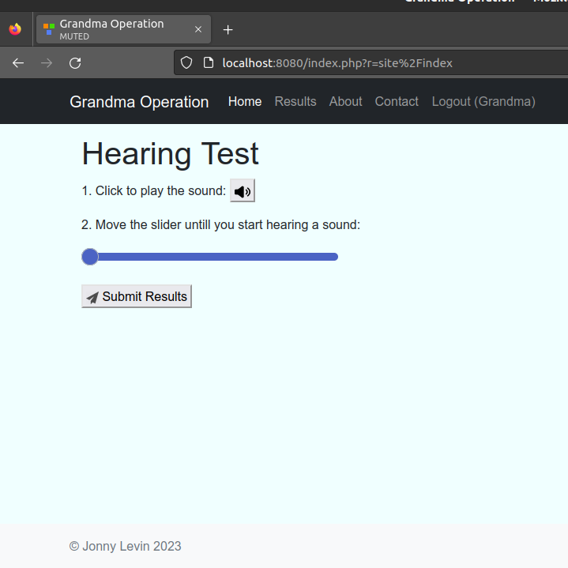
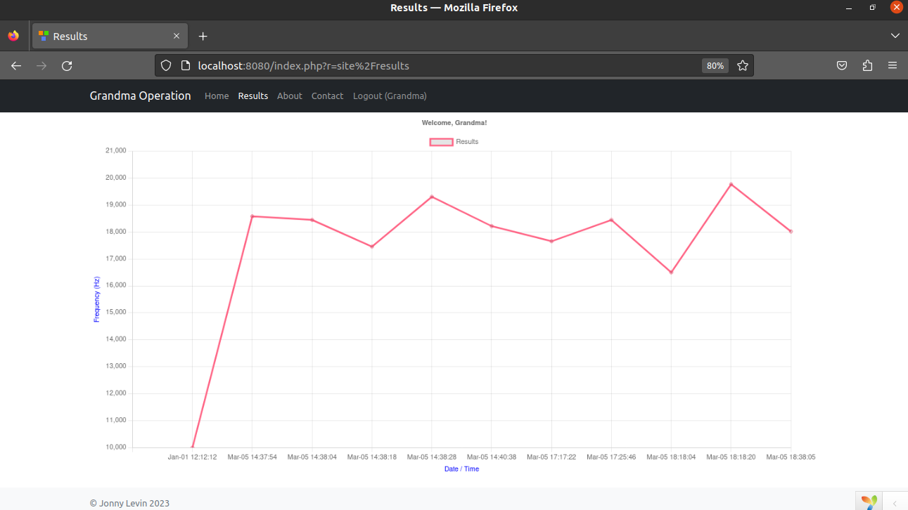
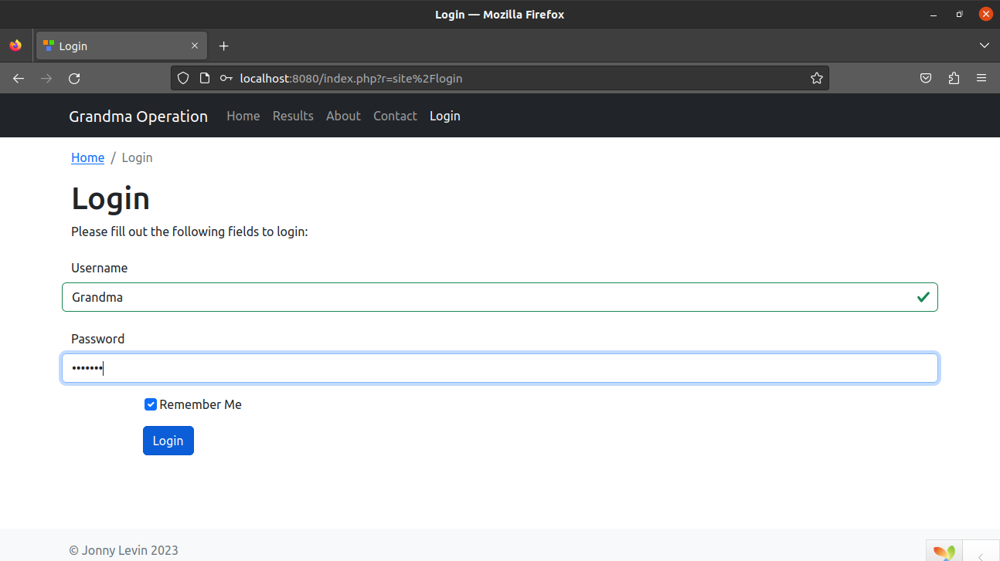
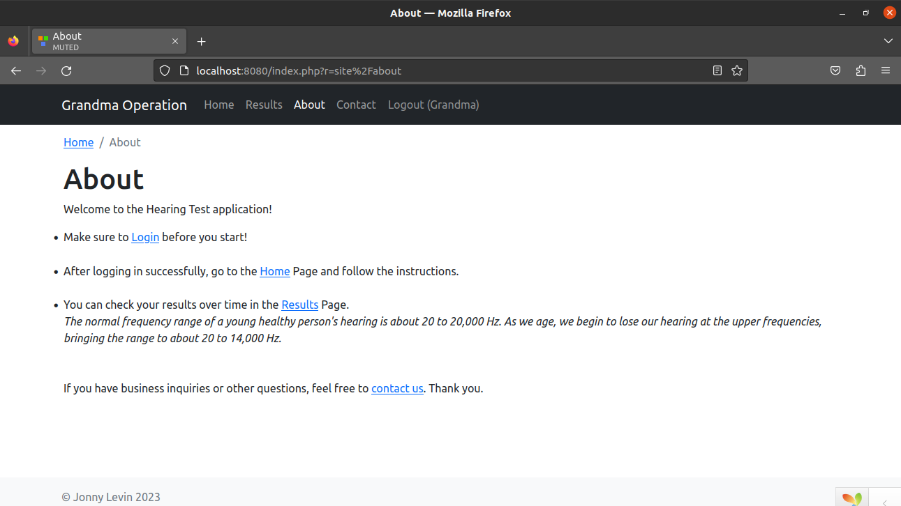

<p align="center">
    <a href="https://github.com/yiisoft" target="_blank">
        
    </a>
    <h1 align="center">Grandma Operation Project</h1>
    <br>
</p>

[](https://packagist.org/packages/yiisoft/yii2-app-basic)
[](https://packagist.org/packages/yiisoft/yii2-app-basic)
[](https://github.com/yiisoft/yii2-app-basic/actions?query=workflow%3Abuild)

DIRECTORY STRUCTURE
-------------------

      assets/             contains assets definition
      commands/           contains console commands (controllers)
      config/             contains application configurations
      controllers/        contains Web controller classes
      mail/               contains view files for e-mails
      models/             contains model classes
      runtime/            contains files generated during runtime
      tests/              contains various tests for the basic application
      vendor/             contains dependent 3rd-party packages
      views/              contains view files for the Web application
      web/                contains the entry script and Web resources


**(Most of the interesting customized logic of the project is in:
<mark>/web</mark> folder, <mark>/views/site</mark> folder, <mark>/models</mark> folder <mark>/controllers</mark> folder & <mark>/config</mark> folder)**

Summary
-------
All requirements were successfully achieved, with some extra added features, (followed demonstration in the end of this readme).

To be improved:
- Seperating the scripts and styling from the php files to seperate independent .js & .css files
- Adding a customized grandma favicon
- Encrypting the Database password and creating a hidden ENV file with all the relevant passwords
- Allowing dynamic registration for more users except 'admin' & 'Grandma'

CONFIG REQUIREMENTS
------------

The minimum requirement by this project:
```
linux ubuntu 20.04
Web server supports PHP 7.4.
MySQL 8.0.32 Database
```

INSTALLATION
------------

### Install from an Archive File

After extracting the zip file of the project, make sure to run the following commands in the terminal:


### <span style="color: red">**⚠️ ! Follow carefully and make sure you don't miss anything ! ⚠️ </span>**
```bash
sudo apt update
```
1. If you need to install PHP:
```bash
sudo apt install php7.4
``` 
2. If you need to install MySQL server package:
```bash
sudo apt install mysql-server
```


Ensure that the server is running using the systemctl start command:
```bash
sudo systemctl start mysql.service
```
open up the MySQL prompt:
```bash
sudo mysql
```
Then, inside the MySQL prompt, run the following ALTER USER command to change the root user’s authentication method to one that uses a password. The following example changes the authentication method to mysql_native_password:
```SQL
ALTER USER 'root'@'localhost' IDENTIFIED WITH mysql_native_password BY '1234';
```
After making this change, exit the MySQL prompt:
```bash
exit
```
If you're having trouble, you can follow the next tutroial to configure the relevant details for the database as described later in CONFIGURATION section:

[**Installation & Configuration of MySQL**](https://www.digitalocean.com/community/tutorials/how-to-install-mysql-on-ubuntu-20-04)


**MANDATORY** to run & install the following: 
```bash
sudo apt install php-gd
sudo apt install php-mysqli
sudo service apache2 restart
```

CONFIGURATION
-------------

### Database
```
Server Address = localhost
Port = 3306
Database = 'results'
Username = 'root'
Password = '1234'
```

Run in command line:

```bash
mysql -u root -p
```

Inside the MySQL prompt, Create the Database:
```SQL
CREATE DATABASE results
```

Than make sure to create the 'results' table as follows:
```SQL
USE results;

CREATE TABLE results (
    id INT PRIMARY KEY AUTO_INCREMENT,
    Result INT NOT NULL,
    Date DATETIME NOT NULL
);
```

**Finally** run the following command from the root folder of the project to build the server and start exploring:
```bash
php yii serve
```

Congratulations, You're Ready to start exploring the site!
-------------
http://localhost:8080/

**NOTES:**
- Make sure that the port of the server is 8080 and the port of the Database is 3306
- To view the results properly, make sure to register to Grandma's user: 

    Username: Grandma
    
    Password: grandma

- To use the web properly, follow the instructions in the ['About'](http://localhost:8080/index.php?r=site%2Fabout) page


Demonstration
-------------



